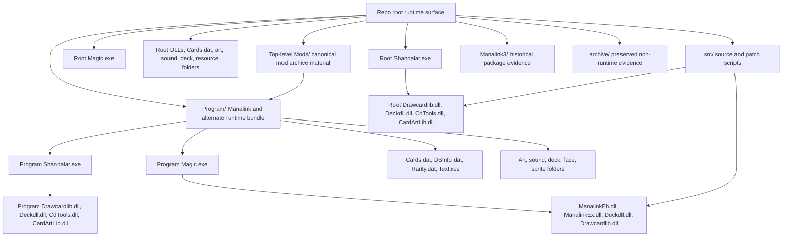

# Repository Architecture

This is a practical map, not a clean-room reconstruction.

## High-Level Map

| Area | Likely role | Evidence level |
| --- | --- | --- |
| Root executable/assets | Current repo-root Shandalar launch surface and copied CrossOver `MTG` launch surface. | Verified by shortcut target, logged `C:\Shandalar\Shandalar.exe` startup, root DLL/assets, root `Magic.exe` access, and the patched repo `Shandalar.exe` start-color smoke test. |
| `Program/` | Manalink launcher runtime bundle and alternate Shandalar layout. | Verified by executables, imported local DLLs, launcher scripts, asset folders, matching `Program\zlib.dll`, adjacent Program config/font/card-data files, and the Program CardArt drawcardlib assets observed so far; direct copied-bottle Program Shandalar still needs visible retesting. |
| `src/` | Source and patch tooling for DLL/card-engine work. | Verified by Makefiles, C/C++/ASM files, and patch scripts. Build not complete here. |
| `magic_updater/` | Perl/CSV card data updater. | Verified by scripts and large CSV inputs. |
| `Mods/` | Canonical active mod archives and mod staging tree. | Verified by `Manalink_Launcher.cmd`, `.7z` archives, and [install-roots.md](install-roots.md). |
| `Manalink3/` | Historical/unsupported Manalink 3 package snapshot. | Verified by nested `Program/`, `Mods/`, and launcher; duplicate archives were removed after top-level `Mods/` was selected as canonical. |
| `PlayDeckAnalyser/` | Separate deck analysis utility. | Verified by readme and config. |
| Art/resource folders | Runtime game art and resource stores. | Verified by file extensions, counts, and strings references. |
| `archive/` | Preserved generated/local/debug/historical files moved out of the root. | Verified by limited reorg decision log and `git mv` paths. |

## Runtime Relationship

## Important Relationships

| Relationship | What is verified | What is inferred or unknown |
| --- | --- | --- |
| Root `Shandalar.exe` and `Program/Shandalar.exe` | Same active SHA-256 in this checkout and copied `MTG`/`Shandalar-Win8-Test` installs: `ad9ee80e0d377e7f1741e48aa0e33c3a8d7bd2873d43045e32bc42812aaa284b`. Both include the `CreateDIBSection hSection = NULL` compatibility patch, the `mPlayer` default-name seed, the name-editor bypass/fallback, and the same-arrow movement-stop code cave. Current `MTG` shortcut targets root `C:\Shandalar\Shandalar.exe`, local bottle copies were patched with backups, and this repo plus the local `MTG` copy now have `Program/zlib.dll`, adjacent Program config/font/card-data files, plus Program CardArt assets observed so far through `Modern/CardOv_Nyx.png`. | Either path may still behave differently because adjacent DLLs/assets differ; the direct copied-bottle Program path failed before the DLL layout fix and then exposed missing Program CardArt/config/font assets plus older Program card-data files. The latest bounded log opened the Program card-data trio, `shandalar.dll`, and `Shandalar.ini` without the earlier fatal strings; full character creation and movement-stop behavior still need visible manual gameplay verification. |
| Root `Shandalar.dll` and `Program/Shandalar.dll` | Same active SHA-256 in this checkout and copied `MTG` install: `f74648745315163da15ffbe32e5bbdbc79e05aaf47c0714902c8d6898e5d00f7`. Both include Shandalar adventure-duel hooks for the AI land CIP resolver stack-bypass at `0x94d34`/`0x1174800` and the C++ AI player-only target selector at `0xcb16`/`0x1174920`. | Static bytes prove the hooks are present, but Augur/Piranha/Bojuka visible retests are still required before claiming gameplay stability. |
| Root `Magic.exe` and `Program/Magic.exe` | Same PE timestamp and imports, different SHA-256; root Shandalar opens root `Magic.exe` in logged startup. | The embedded data or patches differ; test both only with exact path recorded. |
| Root `ManalinkEh.dll` and `Program/ManalinkEh.dll` | Both are patched for the shared Samite/Femeref/Kithkin damage-prevention handler, the generic activated `GAA_DAMAGE_PREVENTION*` helper guard, AI decision-time clamping, AI raw-mana speculation snapshot restore safety, Piranha Marsh/Bojuka Bog trigger targeting, generic AI player-only target selection, and AI land CIP resolver stack-bypass handling. Root patch sites are `0x3bb035`, `0x44cb23` with cave `0x495a30`, `0x40d0e1` with cave `0x495a60`, `0x40db84` with cave `0x495a90`, `0x3fe7a0`, `0x3f63e0`, `0x469583` with cave `0x495ad0`, and resolver hook/cave `0x429acf`/`0x495b00` with restored Piranha/Bojuka callsites at `0x3fe77d`/`0x3f63bd`, SHA-256 `68f2ba31f26f99edfb0944fe3fbc577ef0a42f9f6a6d7d44cb3aaa5f9b9cadd5`; `Program/` patch sites are `0x381a25`, `0x40f115` with cave `0x452c30`, `0x3d2da1` with cave `0x452c60`, `0x3d3844` with cave `0x452c90`, `0x3c4930`, `0x3bc630`, `0x429453` with cave `0x452cd0`, and resolver hook/cave `0x3ec7cf`/`0x452d00` with restored Piranha/Bojuka callsites at `0x3c490d`/`0x3bc60d`, SHA-256 `619ce5d3f80f4ac951418e8a1b2ec803b3b9aa0128e01b827e744b80e63962fc`. | The DLLs differ by path and hash, so copy/test the one adjacent to the exact `Magic.exe` path being launched. The local `MTG` copied install now matches these Manalink hashes, but visible duel retesting is still required. |
| `Program/FaceMaker.exe`, `FaceMaker-nores.exe`, and `Program/FaceMaker-nores.exe` | `Program/FaceMaker-nores.exe` still matches the known Korath/no-resolution helper. Active `Program/FaceMaker.exe` and root `FaceMaker.exe` are patched at file offset `0x5f40`, hash to `41f062874f94d732cc4feb40b568728b8462879fd3ec2bc55810f118e9c5f246`, and differ from the no-resolution helper by 11 bytes. Direct patched root FaceMaker launch in `MTG` rendered without the DIB assertion, and a later visible S2 run logged `FaceMaker-nores.exe /S` while reaching the map. | User testing says the original FaceMaker swap alone did not fix the start-color assertion; the exact Shandalar-to-FaceMaker helper selection still needs more testing before any helper can be removed. |
| `Manalink_Launcher.cmd` and `Program/Magic.exe` | Launcher sets `mlDir` to `Program` and starts `Magic.exe`. | Full launcher menu was not run. |
| `src/patches/*` and shipped binaries | Many patch scripts state they update `Magic.exe` or `Shandalar.exe` in-place. | Current shipped binaries were not traced back to a reproducible patch sequence. |
| `magic_updater/` and CSV/dat files | Scripts and CSV files are present. | No updater command was run in this pass. |
| `Manalink3/` and root `Mods/` | The formerly duplicated archives had identical SHA-256 in both places; top-level `Mods/` is now canonical. | Remaining `Manalink3/Program/` and package files are historical evidence and not active root layout. |

## Major Folder Roles

| Folder | Role |
| --- | --- |
| `Program/CardArt`, `Program/DuelArt`, `Program/Exp1Art`, `Program/ShellArt`, `Program/Statwin`, `Program/SPR*` | Runtime images, sprites, card frames, shell art, and UI resources. |
| `Program/DuelSounds`, `Program/Sound` | Duel and adventure sound assets. |
| `Program/decks`, `Playdeck`, `decks*`, `Decks*` | Deck data collections. |
| `CardArtManalink`, `CardArtNew`, `Cardart` | Large card-art/resource stores; likely not all loaded by one executable path, but not safe to delete without tests. |
| `Classic`, `Editor`, `Facemaker`, `Icons`, `CSV` | Tools, legacy data, or supporting resources. |
| `Manalink`, `ManaLink`, `Manalink3` | Manalink-related data and historical packaged distribution evidence. Case and spacing matter. |
| `archive/generated-local`, `archive/debug-evidence`, `archive/historical-docs`, `archive/historical-links`, `archive/local-helpers`, `archive/backups` | Preserved evidence/history from the limited reorganization pass. These are not current launch paths. |

## Open Questions

| Question | Next test |
| --- | --- |
| Which exact files are required for root and `Program` Shandalar minimal launch? | Use a copy/quarantine test outside the repo, not deletion in-place. |
| Does the patched `Shandalar.exe` fully resolve the start-color assertion and follow-up name/movement issues during real gameplay? | Run a visible new-game flow in `MTG` or `Shandalar-Win8-Test` through character creation, default-name acceptance, same-arrow map stop, save/load, and one duel; the local bottle Shandalar copies are already patched. |
| Does the patched `ManalinkEh.dll` resolve the Femeref Healer or opponent-turn duel freezes? | Copy the patched DLLs into the active copied CrossOver install only with explicit approval, then retest the blocker/Femeref Healer combat scenario and broader opponent-turn behavior. |
| Which `Magic.exe` copy should be the canonical one? | Test root and `Program/` copies separately, record SHA-256 and behavior. |
| Can `src/` rebuild `ManalinkEh.dll` or other DLLs today? | Restore/generate `src/card_id.h`, install MinGW/yasm/dlltool/objcopy, then build in a throwaway branch. |
| What does `Shandalar.exe --help` display? | Manual UI/log capture on Windows or CrossOver. |
