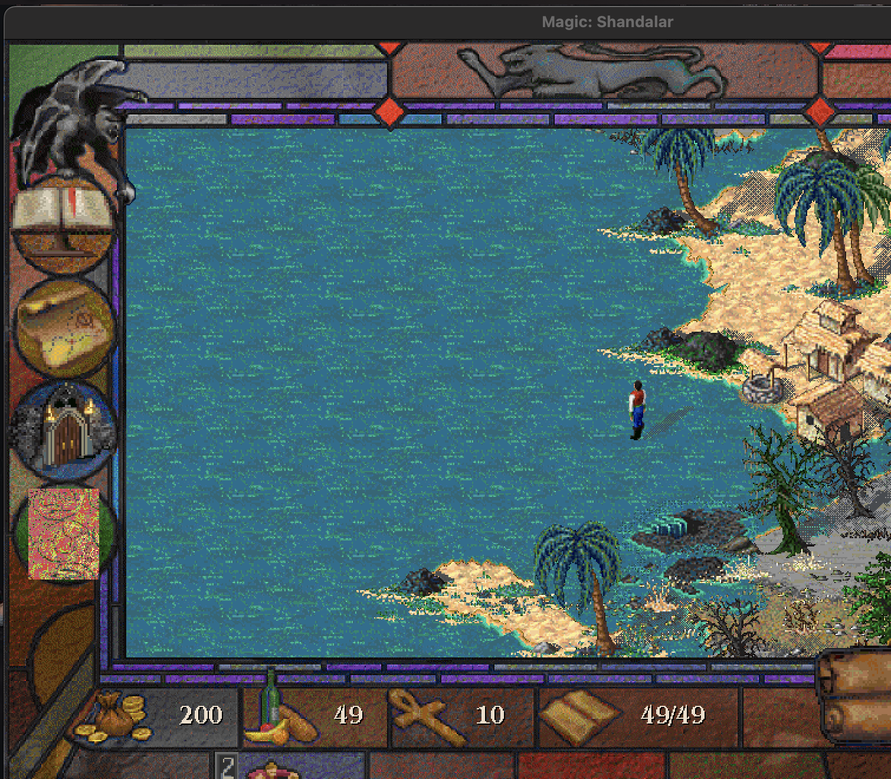

# S2 New-Game Map Evidence

Date: 2026-05-31

This note records a visible CrossOver `MTG` test that advanced the patched root
Shandalar launch path from the main menu to the adventure map. It is evidence
for manual gameplay row S2 only. It does not prove the remaining starting
colors, movement-stop behavior, save/load, duel stability, or regression rows.

## Commands

Run from `/Users/mdmoll/Shandalar/Shandalar`:

```sh
/usr/bin/perl -e 'alarm 90; exec @ARGV' /Applications/CrossOver.app/Contents/SharedSupport/CrossOver/bin/wine --bottle MTG --workdir "C:\Shandalar" --cx-log /tmp/shandalar-visible-s2-attempt-cx.log --debugmsg +seh,+bitmap,+process,+file "C:\Shandalar\Shandalar.exe"
```

After the visible main menu appeared, LaunchServices/AppKit activation was used
to bring the Wine app forward, then Wine `wscript` drove the existing local
SendKeys helper:

```sh
/Applications/CrossOver.app/Contents/SharedSupport/CrossOver/bin/wine --bottle MTG wscript "Y:\Shandalar\Shandalar\local\crossover\sendkeys-to-name-entry-robust.vbs"
```

Screenshot capture and crop:

```sh
screencapture -x /private/tmp/shandalar-after-sendkeys-front.png
sips --cropToHeightWidth 1320 1510 --cropOffset 40 0 /private/tmp/shandalar-after-sendkeys-front.png --out docs/generated/manual-gameplay/s2-map-2026-05-31.png
```

## Observed Result

The cropped visible screenshot shows the `Magic: Shandalar` adventure map:



The raw CrossOver log is local-only because it is large:

```text
/tmp/shandalar-visible-s2-attempt-cx.log
```

Focused log search found the expected post-color/map resources, including
`advfac64.pic`, `magic3.map`, `magic4.map`, and `begin.spr`, and no visible
`WM_CREATE CreateDIBSection` assertion was seen during the run.

The log also observed a `FaceMaker-nores.exe /S` child process during this
visible new-game path. Treat `FaceMaker-nores.exe` as protected runtime
evidence until character creation is better understood; do not archive or
remove it as a mere stale reference.

## Limitations

The SendKeys helper accepted the default/first start-color path. This is
recorded as the S2/default-white pass in
[../../manual-gameplay-verification.md](../../manual-gameplay-verification.md),
but the other color rows remain unverified. The test did not prove save/load,
same-arrow movement stop, duel input stability, the Femeref Healer regression,
or declared-attacker undo.
